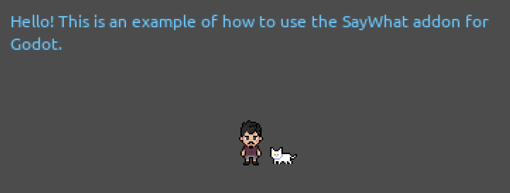

# A quick example SayWhat Godot project

This is a super quick example to use as a jumping off point for how to consume [SayWhat Godot resources](https://github.com/nathanhoad/saywhat_godot) generated from [SayWhat](https://nathanhoad.itch.io/saywhat).

The `main` scene starts the dialogue and handles the dialogue chain by instancing the `dialogue` scene.

The `dialogue` scene handles typing out the dialogue and then either waiting for a set amount of time or waiting for user input.

